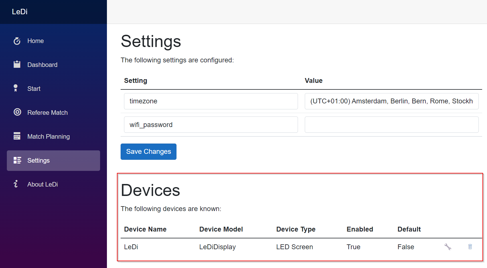
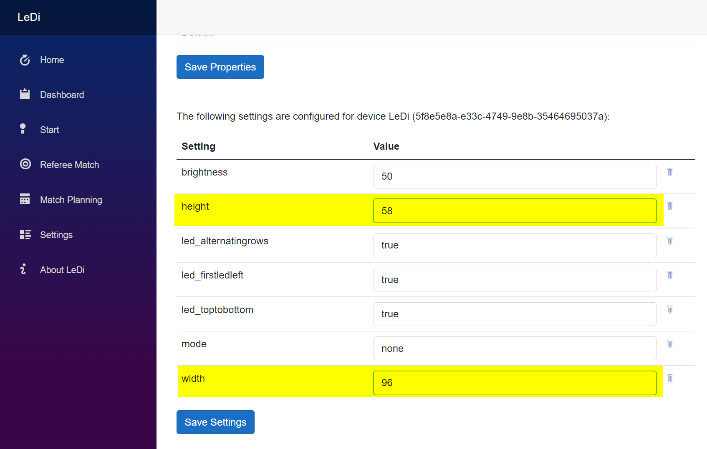
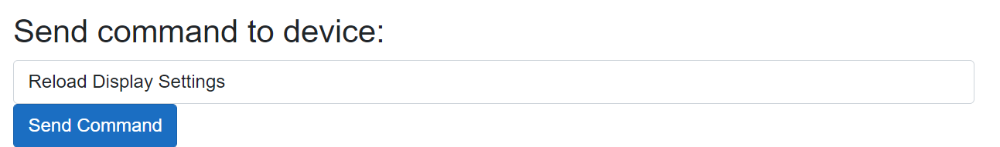
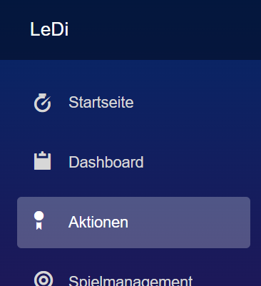
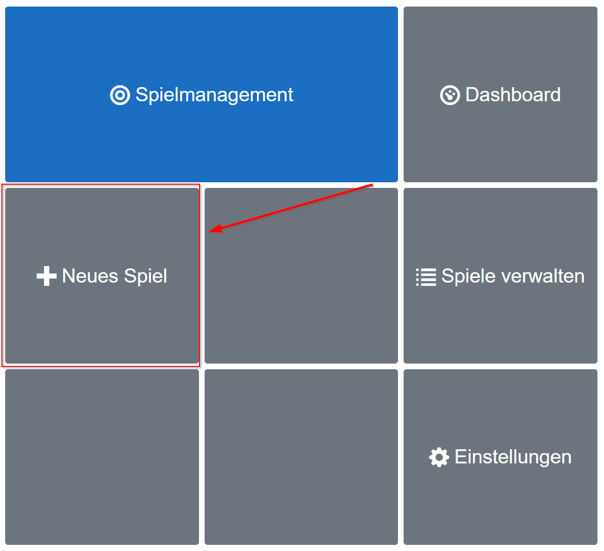
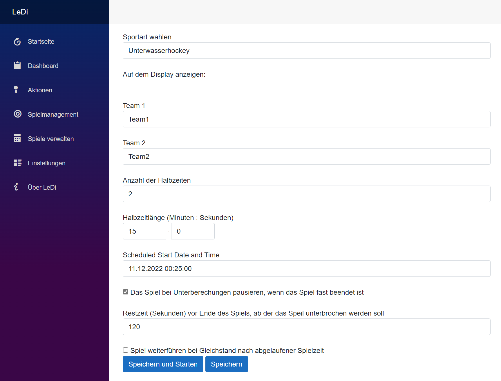

LeDi Benutzeranleitung
======================

Ersteinrichtung
---------------

Nachdem alle drei Dienste erfolgreich gestartet wurden, kann über die URL https://ledi.intern die Bedienoberfläche von LeDi aufgerufen werden, sofern das zugreifende Gerät über das WLAN verbunden ist, das LeDi bereit stellt. Von anderen Geräten muss über den hostnamen https://ledi oder die IP-Adresse zugegriffen werden.

Ledi ist direkt Betriebsbereit. Lediglich ein eventuell angeschlossenes LED Display muss zuvor noch konfiguriert werden.

Display einrichten
##################

Um ein angeschlossenes LED Display zu konfigurieren, muss ggf. zunächst die ``config.conf`` im ``/opt/LeDi.Display``-Verzeichniss bearbeitet werden - sofern nicht die Standardkonfiguration genutzt werden soll.

Standardmäßig sieht diese wie folgt aus

.. code-block:: text
    :linenos:
    ServerUrl:https://localhost:5001/api/
    DeviceType:LED Screen
    DeviceModel:LeDiDisplay
    GpioPin:18
    PwmChannel:0

Dies heißt, dass die Schnittstelle zur Server-Komponente auf dem gleichen Gerät auf Port 5001 läuft. Außerdem meldet sich das Display als Gerätetyp ``LED Screen`` und dem Gerätemodell ``LeDiDisplay``. Auf dem Raspberry Pi wird zudem der GPIO-Port 18 (Pin #12) genutzt. Hier ist auch der GPIO-Port 12 (Pin #32) möglich. Beide Pins sind für den PWM0 Channel vorgesehen. Wird der PWM1 Channel genutzt, muss die entsprechende Setting auf 1 geändert werden und entweder der GPIO Port 13 (Pin #33) oder der GPIO Port 19 (Pin #35) genutzt und konfiguriert werden.

Nach der Änderung der Konfiguration muss der Dienst einmal neu gestartet werden:

.. code-block:: bash
    :linenos:
    sudo systemctl restart ledi.display

Nun auf der LeDi-Benutzeroberfläche auf den Menüpunkt "Einstellungen" wechseln. Dort wird das Display nun angezeigt.

Hier auf das kleine 🔧-Symbol klicken. Auf der nun erscheinenden Seite zu den Einstellungen gehen. Dort gibt es die Einstellungen ``height`` (= Höhe) und ``Width`` (= Breite). Diese müssen nun auf die Anzahl der LEDs gesetzt werden, die das Display in der Größe hat. z.B. 58x96. Anschließend auf "Einstellungen speichern" klicken (es erfolgt keine Reaktion).

.. note:: 
    Hinweis: Aktuell stehen Display-Layouts in folgenden Größen zur Verfügung (Breite x Höhe): 20x10, 60x10, 96x58, 96x60. Andere Größen müssen im Verzeichniss des Display Dienstes unter /Config/Layouts angelegt werden.

Des Weiteren gibt es noch die Optionen ``led_alternatingrows``, ``led_firstledleft`` und ``led_toptobottom``. Die erste Option ist in der Regel immer ``true``, da die LEDs auf dem Display in der Regel immer abwechselnd von links nach rechts und wieder zurück laufen. Sollte man beim Zusammenbau alle immer z.B. von links nach rechts laufen lassen, dann muss diese Option auf ``false``. ``led_firstledleft`` definiert, ob die Einspeisung der Daten auf der linken oder rechten Seite des Displays erfolgt. Ist dies auf der linken Seite, so ist der Wert auf ``true`` zu setzen. Ist dies auf der rechten Seite, so muss dieser Wert ``false`` lauten. Zuletzt kann mit der Option ``led_toptobottom`` noch eingestellt werden, ob die Einspeisung oben oder unten am Display erfolgt. Erfolgt diese unten, so ist der Wert auf ``false`` zu setzen. Erfolgt diese oben, dann auf ``true``. Hier hilft es ggf. auch nach der ersten Konfiguration mit den Werte ein bisschen zu spielen, falls das Ergebniss nicht sofort das gewünschte Ergebniss ist (z.B. steht die Anzeige auf dem Kopf oder ist gespiegelt.).

Nun ein bisschen nach unten scrollen und unter "Befehl an Gerät übermitteln:" in der Auswahlbox "Geräteeinstellung neu laden" auswählen und auf "Befehl senden" klicken.

Wenn alles korrekt eingerichtet ist, ist die erste Zeile LEDs nun weiß und die letzte Zeile der LEDs nun grün.
Somit ist die Einrichtung des Displays abgeschlossen.

Spiel erstellen
---------------

Um ein Spiel zu erstellen, folgende Schritte durchführen:
1. In der Navigation ``Aktionen`` auswählen.

2. Auf der Seite nun ``Neues Spiel`` auswählen.

3. Nun kann die Sportart ausgewählt werden. Aktuell gibt es lediglich ``Unterwasserhockey``. Nach dem Auswählen der Sportart erscheinen weitere Einstellungsmöglichkeiten. Hier kann z.B. definiert werden wie die Teams heißen, die gegeneinander spielen. Auch die Anzahl der Halbzeiten, die Halbzeitlänge, der voraussichtliche Start des Spiels sowie die Regel, dass zwei Minuten vor Ende die Zeit bei einer Unterbrechung pausiert, können hier angegeben werden. Wenn alle Parameter eingestellt sind, kann das Spiel entweder gespeichert und sofort gestartet werden oder aber, z.B. für eine Turnierplanung, das Spiel nur gespeichert werden.

Spiel betreuen
--------------

Um ein Spiel zu begleiten und LeDi während eines Spiels zu steuern kann entweder in der Navigation direkt ``Spielmanagement`` ausgewählt werden oder über die ``Aktionen``-Seite die Schaltfläche ``Spielmanagement``. Hier muss nun das Spiel gewählt werden, welches nun stattfinden soll. Sofern zuvor ``Speichern und Starten`` gewählt wurde, ist dies nicht notwendig. Anschließend ist die Bedienoberfläche zu sehen, die das Display während eines Spiels steuert.

.. image:: images/ledi-usage/07-Spielmanagement.png
    :alt: LeDi Settings page
    :scale: 50 %

Die Schaltflächen im Einzelnen:

+----------------------------+------------------------------------------------+
| Schaltfläche               | Funktion                                       |
+============================+================================================+
| Tor                        | Fügt dem entsprechenden Team einen Punkt hinzu |
+----------------------------+------------------------------------------------+
| Tor zurücknehmen           | Zieht dem entsprechendem Team einen Punkt ab   |
+----------------------------+------------------------------------------------+
| Start/Fortfahren           | Startet das Spiel/die Spielzeit                |
+----------------------------+------------------------------------------------+
| Pause                      | Stoppt das Spiel/die Spielzeit                 |
+----------------------------+------------------------------------------------+
| Strafen                    | Ruft den Dialog auf um eine Strafe zu vergeben |
+----------------------------+------------------------------------------------+
| Zeige erweiterte Steuerung | Zeigt weniger häufig genutzte Optionen         |
+----------------------------+------------------------------------------------+
| Spiel abbrechen            | Bricht ein Spiel ab und beendet dieses dadurch |
+----------------------------+------------------------------------------------+
| Spiel neustarten           | Startet ein Spiel neu                          |
+----------------------------+------------------------------------------------+
| Setze Spielzeit            | Möglichkeit die Restspielzeit zu modifizieren  |
+----------------------------+------------------------------------------------+
| Zeige auf Display          | Auf welchem Display wird das Spiel gezeigt     |
+----------------------------+------------------------------------------------+
| Strafe zurücknehmen        | Eine eingetragene Strafe zurücknehmen          |
+----------------------------+------------------------------------------------+

Unterhalb der Schaltflächen ist dann noch ein Logbuch zu sehen, in dem alle Ereignisse des Spiels noch einmal zusammengefasst abgebildet sind.

Ablauf eines Spiels
###################

- Wenn ein Spiel beginnt, wird mit einem Klick auf ``Start/Fortfahren`` die Zeit gestartet.
- Wenn ein Timeout genommen wird, egal welcher Art, wird mit ``Pause`` die Zeit angehalten. Anschließend wieder mit ``Start/Fortfahren`` gestartet.
- Wenn ein Tor fällt, wird dies mit der linken Schaltfläche für das linke Team und mit der rechten Schaltfläche für das rechte Team notiert.
- Wenn ein Spieler oder ein Team eine Strafe, ins besondere Strafzeiten, bekommt, dann kann dies über ``Strafen`` eingetragen werden. Eine Strafzeit läuft dann auch in der Anzeige ab.

Spiele verwalten
----------------

In dem Menüpunkt ``Spiele verwalten`` können alle Spiele noch einmal in einer Übersicht angezeigt werden. Hier sind die anstehenden, laufenden und beendeten Spiele zu sehen. Über die Schaltfläche ``Bearbeiten`` können diese noch editiert werden.